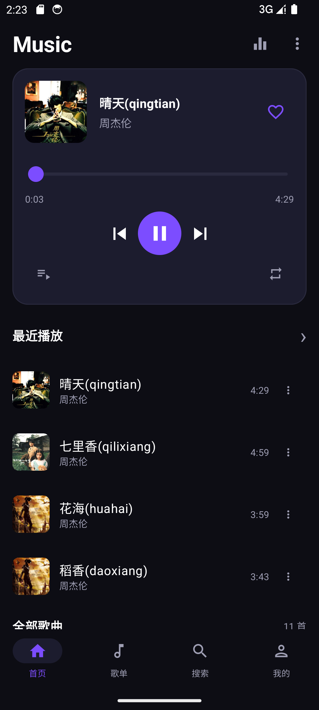
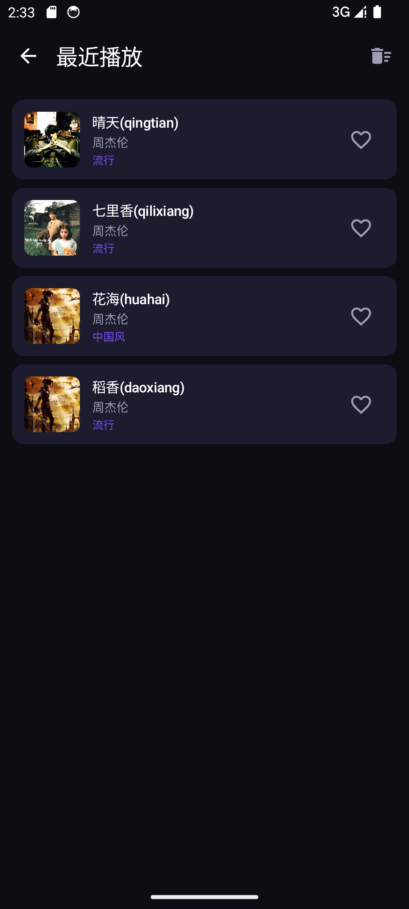
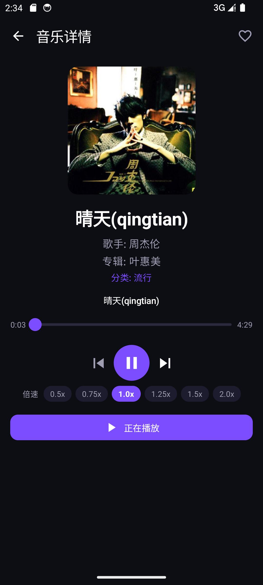

# 项目名称

GitHub 仓库地址：https://github.com/Persimmon4/MelodyFlow.git

## 1. 项目简介

# 🎵 MelodyFlow

> A modern local music player built with Kotlin and Jetpack Compose.

GitHub Repository：
https://github.com/Persimmon4/MelodyFlow

---

# 📖 项目简介

**MelodyFlow** 是一款基于 Android 平台开发的本地音乐播放器，采用 **Jetpack Compose** 构建现代化 UI，结合 **MVVM** 架构，实现了音乐浏览、播放控制、最近播放、歌曲详情、分类浏览以及深色模式等功能。

整个应用采用深色主题设计，以紫色作为品牌主色，界面简洁、操作流畅，致力于为用户提供舒适的本地音乐播放体验。

---

# ✨ 功能特色

- 🎵 本地音乐浏览
- ▶️ 音乐播放（播放 / 暂停）
- ⏮️ 上一首 / 下一首切换
- ⏩ 播放进度控制
- ❤️ 收藏歌曲
- 🕒 最近播放记录
- 📂 歌曲分类浏览
- 🎼 音乐详情页面
- ⚙️ 深色模式切换
- 📱 Material Design 3 界面设计

---

# 📱 页面展示

## 首页（Home）

首页展示播放器卡片、最近播放以及全部歌曲列表。

主要功能：

- 当前播放歌曲
- 最近播放
- 分类筛选
- 歌曲列表浏览


---

## 播放器

播放器支持：

- 播放/暂停
- 上一首
- 下一首
- 拖动播放进度
- 收藏歌曲



---

## 最近播放

记录用户最近播放过的音乐。

支持：

- 最近播放列表
- 收藏歌曲
- 删除播放记录



---

## 音乐详情

展示歌曲详细信息：

- 歌曲名称
- 歌手
- 专辑
- 分类
- 封面
- 播放控制
- 倍速播放（0.5x ~ 2.0x）



---

## 我的

提供应用设置。

目前支持：

- 深色模式切换


---

# 🏗 项目架构

项目采用 **MVVM Architecture**。

```
                ┌────────────────────────────┐
                │         UI Layer           │
                │  Jetpack Compose Screens   │
                │ Home / Detail / Search ... │
                └────────────┬───────────────┘
                             │
                             ▼
                ┌────────────────────────────┐
                │        ViewModel Layer     │
                │      MusicViewModel        │
                │      MusicUiState          │
                └────────────┬───────────────┘
                             │
                             ▼
                ┌────────────────────────────┐
                │      Repository Layer      │
                │      MusicRepository       │
                └────────────┬───────────────┘
         ┌───────────────────┼────────────────────┐
         ▼                   ▼                    ▼
┌────────────────┐  ┌─────────────────┐  ┌────────────────┐
│ Room Database  │  │ Mock Network    │  │ DataStore      │
│ Favorite DAO   │  │ NetworkDataSrc  │  │ UserPreference │
│ Recent DAO     │  │ MusicDto        │  │ Dark Mode      │
│ Category DAO   │  └─────────────────┘  └────────────────┘
         │
         ▼
┌─────────────────────┐
│ MediaPlayer Manager │
│ 播放控制             │
└─────────────────────┘
```

项目结构：

```
app
└── src
    └── main
        └── java
            └── com.musiccollect
                │
                ├── data
                │   ├── dao
                │   │   ├── FavoriteMusicDao
                │   │   ├── MusicCategoryDao
                │   │   └── RecentlyPlayedDao
                │   │
                │   ├── database
                │   │   └── AppDatabase
                │   │
                │   ├── entity
                │   │   ├── FavoriteMusic
                │   │   ├── MusicCategory
                │   │   └── RecentlyPlayed
                │   │
                │   ├── network
                │   │   ├── dto
                │   │   │   └── MusicDto
                │   │   └── NetworkDataSource
                │   │
                │   ├── repository
                │   │   └── MusicRepository
                │   │
                │   └── datastore
                │       └── UserPreferencesRepo
                │
                ├── navigation
                │   └── AppNavGraph
                │
                ├── player
                │   └── MusicPlayerManager
                │
                ├── ui
                │   ├── components
                │   ├── screens
                │   ├── theme
                │   └── viewmodel
                │
                └── MainActivity
```

---

# 🛠 技术栈

| 技术 | 说明 |
|------|------|
| Kotlin | 开发语言 |
| Jetpack Compose | UI开发 |
| Material 3 | UI组件 |
| MVVM | 架构模式 |
| Navigation Compose | 页面导航 |
| ViewModel | 状态管理 |
| StateFlow | 数据流 |
| Kotlin Coroutines | 异步处理 |
| MediaPlayer | 音乐播放 |
| Coil | 图片加载 |

---

# 📂 功能模块

## 首页

- 推荐播放器
- 最近播放
- 全部歌曲
- 分类筛选

---

## 播放器

支持：

- 播放
- 暂停
- 上一首
- 下一首
- 进度条
- 收藏

---

## 最近播放

- 自动记录播放历史
- 收藏歌曲
- 删除历史记录

---

## 音乐详情

展示：

- 封面
- 歌曲信息
- 歌手
- 专辑
- 分类
- 倍速播放

---

## 设置

目前支持：

- 深色模式

---

# 📂 数据来源

目前项目采用 Mock 数据模拟本地音乐。

主要包含：

- 歌曲ID
- 歌曲名称
- 歌手
- 专辑
- 分类
- 时长
- 封面
- 本地音频资源

音频资源统一存放：

```
res/raw
```

歌曲封面：

```
res/drawable
```

---

# 🚀 运行环境

Android Studio Hedgehog 或以上版本

最低 SDK：

```
API 24
(Android 7.0)
```

推荐：

```
API 34
(Android 14)
```

---

# ▶️ 运行项目

```bash
git clone https://github.com/Persimmon4/MelodyFlow.git
```

打开 Android Studio：

```
Open Project
```

等待 Gradle 同步完成。

运行：

```
Run App
```

即可启动项目。

---

# 📌 项目亮点

- Material 3 深色主题
- Jetpack Compose 全页面开发
- MVVM 架构设计
- 音乐播放器控制组件
- 最近播放管理
- 倍速播放
- 分类浏览
- 紫色主题视觉风格
- UI 动画流畅

---

# 🔮 后续优化

计划增加：

- 🔍 歌曲搜索
- 🎶 歌单管理
- ❤️ 收藏列表
- 🎧 后台播放
- 🔔 通知栏控制
- 📀 本地自动扫描音乐
- 🎵 歌词同步显示
- 🌐 在线音乐接口
- ☁️ 云歌单同步

---

# 👨‍💻 作者

**xue**

Android Music Player

Built with  using Kotlin & Jetpack Compose.